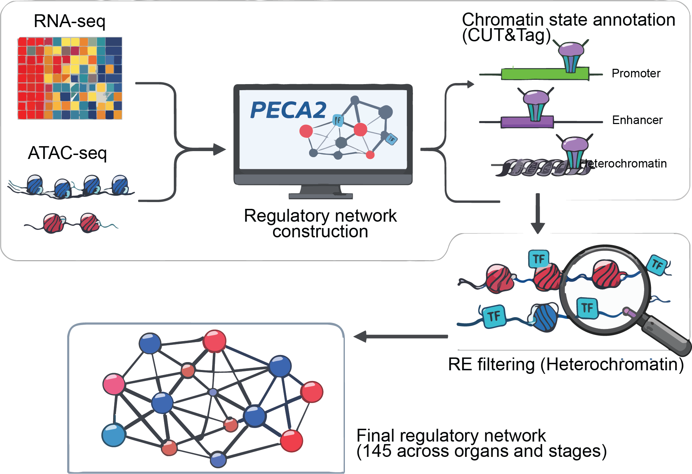

# MonkeyRegulome
MonkeyRegulome is a developmental multi-omics atlas in macaques bridges inaccessible stages of human organ development
## Data processing

### RNA-seq
```bash
# rna_pipeline fq1 fq2 sample_name
rna_pipeline /lustre/home/zhangfy/MacaqueTtoT-test/Brain/rna/RM22050501-P0-RNA/RM22050501-P0-RNA_R1.fq.gz /lustre/home/zhangfy/MacaqueTtoT-test/Brain/rna/RM22050501-P0-RNA/RM22050501-P0-RNA_R2.fq.gz Brain_P0_Rep1
```
### ATAC-seq
Run every repliacte:
```bash
# atac_pipeline_single fq1 fq2 replicate_name
atac_pipeline_single /lustre/home/zhangfy/MacaqueTtoT-test/Brain/atac/RM22050501-Bulk-ATAC-1/RM22050501-Bulk-ATAC-1_R1.fq.gz /lustre/home/zhangfy/MacaqueTtoT-test/Brain/atac/RM22050501-Bulk-ATAC-1/RM22050501-Bulk-ATAC-1_R2.fq.gz Brain_P0_Rep1
atac_pipeline_single /lustre/home/zhangfy/MacaqueTtoT-test/Brain/atac/RM22050501-Bulk-ATAC-2/RM22050501-Bulk-ATAC-2_R1.fq.gz /lustre/home/zhangfy/MacaqueTtoT-test/Brain/atac/RM22050501-Bulk-ATAC-2/RM22050501-Bulk-ATAC-2_R2.fq.gz Brain_P0_Rep2
```
Then call peak by merging all replicates
```bash
# atac_pipeline_single ta1 ta2 sample_name
atac_pipeline_merge ta1 ta2 Brain_P0
```

### Cut&Tag
Run IgG:
```bash
# cutag_pipeline_align fq1 fq2 replicate_name
cutag_pipeline_align /lustre/home/zhangfy/MacaqueTtoT-test/Brain/cuttag/P0/CUT-Tag-RM22050501_P0-Brain-IgG-1/CUT-Tag-RM22050501_P0-Brain-IgG-1_1.fq.gz /lustre/home/zhangfy/MacaqueTtoT-test/Brain/cuttag/P0/CUT-Tag-RM22050501_P0-Brain-IgG-1/CUT-Tag-RM22050501_P0-Brain-IgG-1_2.fq.gz Brain_P0_IgG_Rep1
cutag_pipeline_align /lustre/home/zhangfy/MacaqueTtoT-test/Brain/cuttag/P0/CUT-Tag-RM22050501_P0-Brain-IgG-2/CUT-Tag-RM22050501_P0-Brain-IgG-2_1.fq.gz /lustre/home/zhangfy/MacaqueTtoT-test/Brain/cuttag/P0/CUT-Tag-RM22050501_P0-Brain-IgG-2/CUT-Tag-RM22050501_P0-Brain-IgG-2_2.fq.gz Brain_P0_IgG_Rep2
# cutag_pipeline_merge ta1 ta2 sample_name
cutag_pipeline_merge /lustre/home/zhangfy/Pipeline/Test/Brain_P0_IgG_Rep1/Bam/Brain_P0_IgG_Rep1.tagAlign.gz /lustre/home/zhangfy/Pipeline/Test/Brain_P0_IgG_Rep2/Bam/Brain_P0_IgG_Rep2.tagAlign.gz Brain_P0_IgG
```
Run every replicate of histone marker:
```bash
# cutag_pipeline_align fq1 fq2 replicate_name
cutag_pipeline_align /lustre/home/zhangfy/MacaqueTtoT-test/Brain/cuttag/P0/CUT-Tag-RM22050501_P0-Brain-H3K27ac-1/CUT-Tag-RM22050501_P0-Brain-H3K27ac-1_1.fq.gz /lustre/home/zhangfy/MacaqueTtoT-test/Brain/cuttag/P0/CUT-Tag-RM22050501_P0-Brain-H3K27ac-1/CUT-Tag-RM22050501_P0-Brain-H3K27ac-1_2.fq.gz Brain_P0_H3K27ac_Rep1
cutag_pipeline_align /lustre/home/zhangfy/MacaqueTtoT-test/Brain/cuttag/P0/CUT-Tag-RM22050501_P0-Brain-H3K27ac-2/CUT-Tag-RM22050501_P0-Brain-H3K27ac-2_1.fq.gz /lustre/home/zhangfy/MacaqueTtoT-test/Brain/cuttag/P0/CUT-Tag-RM22050501_P0-Brain-H3K27ac-2/CUT-Tag-RM22050501_P0-Brain-H3K27ac-2_2.fq.gz Brain_P0_H3K27ac_Rep2
# cutag_pipeline_merge ta1 ta2 sample_name
cutag_pipeline_merge /lustre/home/zhangfy/Pipeline/Test/Brain_P0_H3K27ac_Rep1/Bam/Brain_P0_H3K27ac_Rep1.tagAlign.gz /lustre/home/zhangfy/Pipeline/Test/Brain_P0_H3K27ac_Rep2/Bam/Brain_P0_H3K27ac_Rep2.tagAlign.gz Brain_P0_H3K27ac
```
Then call peak:
```bash
# cutag_pipeline_callpeak ta cta sample_name
cutag_pipeline_callpeak /lustre/home/zhangfy/Pipeline/Test/Brain_P0_H3K27ac/Ta/Brain_P0_H3K27ac.pooled.tagAlign.gz /lustre/home/zhangfy/Pipeline/Test/Brain_P0_IgG/Ta/Brain_P0_IgG.pooled.tagAlign.gz Brain_P0_H3K27ac
```

## GRN Atlas

Run GRN for every sample:
```bash
Name=`cat ../MakePrior/SampleNameFile.txt | head -n $SLURM_ARRAY_TASK_ID | tail -n 1`
source PECA.sh ${Name}
```
## MIL model
Training for every organ:
```bash
/home/users/zyfeng/MainDir/Software/Anaconda3/bin/python3 MonkeyMIL_Train.py \
	--count-matrix ./CountMatrix/Monkey${tissue}Count.txt \
	--out-dir ./saved_model/${tissue} \
	--tissue $tissue \
	--label-order CA-CTCF CA-H3K4me3 PLS dELS pELS non_cCRE \
	--min-observed-markers 3 \
	--n-splits 5 \
	--learning-rate 3e-3 \
	--lr-scheduler warmup-cosine \
	--warmup-epochs 5 \
	--min-learning-rate 1e-5 \
	--val-fraction 0.1 \
	--seed 20260613 \
	--epochs 50 \
	--patience 8 \
	--batch-size 256 \
	--eval-batch-size 512 \
	--context-dropout-prob 0.0 \
	--single-context-prob 0.0 \
	--device cuda \
	--amp
```
Predicting for every organ:
```bash
/home/users/zyfeng/MainDir/Software/Anaconda3/bin/python3 MonkeyMIL_Pred.py \
	--model ./saved_model/${tissue}/final_model.pt \
	--features ./${tissue}/Monkey${tissue}E130.prediction_input.tsv \
	--out ./${tissue}/Monkey${tissue}E130.prediction_output.tsv \
	--context-column context \
	--device cuda \
	--amp
```